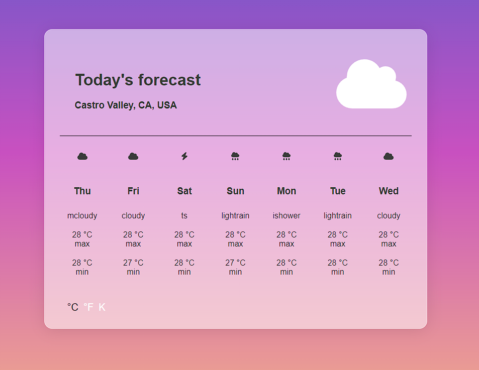

# React Weather API App

React Weather API App is a web-based application that displays the weather conditions of tour current location.
The app utilizes a weather API to retrieve real-time weather data and displays it in an intuitive and user-friendly interface.

# Features

• Display of current weather conditions

• Display of temperature, humidity, wind speed, and weather description

• Display of daily and hourly weather forecast for the next 7 days

• Ability to switch between metric and imperial units

# Usage

To use React Weather API App, simply navigate to the project's website.
The app will then retrieve and display the current weather conditions for the location, including the temperature, humidity, wind speed, and weather description.

Users can also view the daily and hourly weather forecast for the next 7 days by clicking on the "Forecast" button. The forecast data includes the high and low temperatures, humidity, and weather description for each day or hour.

The app also provides the option to switch between metric and imperial units for temperature and wind speed.

## Available Scripts

In the project directory, you can run:

### `npm run start:frontend` for the client
### `npm run start` for the server

The page will reload when you make changes.\
You may also see any lint errors in the console.

# Technologies

React Weather API App is built using React, with the following libraries and APIs:

Geocoding API: for retrieving weather data
Bootstrap: for styling and layout
